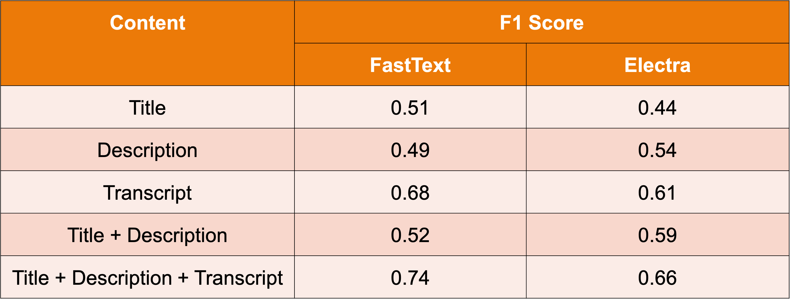

<b><u>Aim</u></b>: A large scale ML system which generates a multi-label output (a summary of video) and helps filter out various forms of inappropriate content with high precision and throughput

## Problem Overview

- Plethora of unsafe content varies, includes abusive content, violence, impersonation, deep fakes, hate speech, NSFW, misinformation, and child unsafe content amongst others

- Presence of high volumes of heterogeneous multimodal data including videos with audio, images, natural language description, community populated contents 

> Over the last 6 months there has been a <a href="https://www.business-standard.com/article/technology/youtube-sees-surge-in-subscriber-base-views-due-to-covid-19-lockdown-120042100710_1.html">98% increase</a> in the viewership of COVID related videos. Study shows that <a href="https://www.sciencedaily.com/releases/2020/05/200513200408.htm">1 in 4 videos</a> contain misinformation.

## Proposed System

Detect the following kind of videos

- **Toxic content**: Content with insult, hate speech, threat, or abusive language.
- **Violent and graphic content**: Extremely gory or violent content, created to be sensational or shock audiences. 
- **Pornographic content**: Content displaying nudity and sexual content, especially if targeted at kids or sensitive content where intent is good but consumption can be harmful like massage
- **Others**: Spam, Dangerous content, Misinformation etc. 

## Results

## Business Applications

- **Brand Safety**: Ensure the integrity of the brand value. 
- **Ad Monetization**: Save from  risk of being demonetized. 
- **Regulations & Compliance**: Help YT adhere to rules & regulations set by the governments.
- **Safe for Kids and Teenagers**: Make sure YouTube is safe for educational purposes

